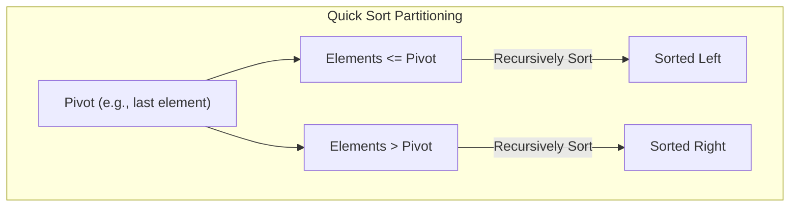
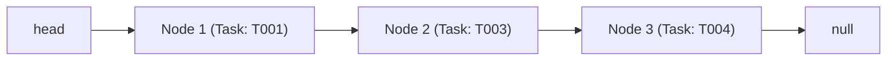
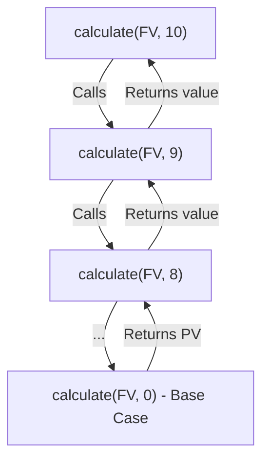

# Data Structures & Algorithms (DSA) Hands-on Exercises

This repository contains implementations and analysis of core Data Structures and Algorithms (DSA) concepts in Java. Each exercise focuses on a specific real-world scenario to demonstrate the practical application of arrays, linked lists, hash maps, sorting, searching, and recursion.

---

## 📂 Project Structure

```
DSA_Algo/
├── readme.md (Main readme containing explanations and diagrams)
├── Exercise_1_Inventory_Management/
│   ├── Product.java           # Product model
│   ├── Inventory.java         # HashMap-based inventory manager
│   ├── Main.java              # Execution and testing driver
│   └── README.md              # Detailed concept & complexity analysis
├── Exercise_2_Ecommerce_Platform_Search/
│   ├── Product.java           # Comparable Product model
│   ├── SearchAlgorithms.java  # Linear and Binary search implementations
│   ├── Main.java              # Execution and testing driver
│   └── README.md              # Analysis of search complexities
├── Exercise_3_Sorting_Customer_Orders/
│   ├── Order.java             # Order model with price
│   ├── SortingAlgorithms.java # Bubble Sort & Quick Sort implementations
│   ├── Main.java              # Execution and testing driver
│   └── README.md              # Comparison of sorting performance
├── Exercise_4_Employee_Management_System/
│   ├── Employee.java          # Employee model
│   ├── EmployeeManager.java   # Contiguous array manager with shifting
│   ├── Main.java              # Execution and testing driver
│   └── README.md              # Array memory representation & limitations
├── Exercise_5_Task_Management_System/
│   ├── Task.java              # Task model
│   ├── SinglyLinkedList.java  # Custom Singly Linked List with Nodes
│   ├── Main.java              # Execution and testing driver
│   └── README.md              # Linked list vs Array analysis
├── Exercise_6_Library_Management_System/
│   ├── Book.java              # Book model sorted by title
│   ├── Library.java           # Title-based search algorithms
│   ├── Main.java              # Execution and testing driver
│   └── README.md              # Search selection strategies
└── Exercise_7_Financial_Forecasting/
    ├── Forecasting.java       # Recursive & Iterative growth forecasters
    ├── Main.java              # Execution and testing driver
    └── README.md              # Recursion call stack & optimization
```

---

## 📊 Summary of Complexity & Analysis

The table below summarizes the time and space complexity of the chosen data structures and algorithms implemented across the exercises:

| Exercise | Concept / Structure | Operations | Time Complexity | Space Complexity |
|:---|:---|:---|:---:|:---:|
| **1. Inventory** | `HashMap` | Add / Update / Delete | \(O(1)\) (Average) | \(O(N)\) |
| **2. Search** | Linear vs Binary Search | Search by name | Linear: \(O(N)\)<br>Binary: \(O(\log N)\) | \(O(1)\) |
| **3. Sorting** | Bubble vs Quick Sort | Sort orders by price | Bubble: \(O(N^2)\)<br>Quick: \(O(N \log N)\) | Bubble: \(O(1)\)<br>Quick: \(O(\log N)\) |
| **4. Employee**| Contiguous Array | Add / Search / Delete | Add: \(O(1)\)<br>Search: \(O(N)\)<br>Delete: \(O(N)\) | \(O(N)\) |
| **5. Task** | Singly Linked List | Add / Search / Delete | Add: \(O(N)\) (or \(O(1)\))<br>Search: \(O(N)\)<br>Delete: \(O(N)\) | \(O(N)\) |
| **6. Library**  | Title-based Search | Search books by title | Linear: \(O(N)\)<br>Binary: \(O(\log N)\) | \(O(1)\) |
| **7. Forecast** | Recursion vs Iteration | Future value forecasting | Recursive: \(O(N)\)<br>Iterative: \(O(N)\) | Recursive: \(O(N)\)<br>Iterative: \(O(1)\) |

---

## 🎨 Visual Explanations & Code Architecture

### 1. Inventory Management System
We use a `HashMap` keying product IDs to product records for immediate, constant-time data access.

```mermaid
graph LR
    subgraph HashMap Storage
        K1["ID: P001"] --> V1["Product [Laptop, Qty: 15, Price: $949.99]"]
        K2["ID: P002"] --> V2["Product [Smartphone, Qty: 25, Price: $499.99]"]
    end
    
    User[Client Application] -->|addProduct O(1)| HashMap
    User -->|updateProduct O(1)| HashMap
    User -->|deleteProduct O(1)| HashMap
```

**Key Code Snippet (`Inventory.java`):**
```java
// Fast O(1) Operations using HashMap
public void addProduct(Product product) {
    products.put(product.getProductId(), product);
}

public void updateProduct(String productId, int newQuantity, double newPrice) {
    Product product = products.get(productId);
    if (product != null) {
        product.setQuantity(newQuantity);
        product.setPrice(newPrice);
    }
}
```

---

### 2 & 6. E-commerce Search & Library Management
Linear search scans every element, while Binary search divides the sorted search space in half each iteration.

```mermaid
graph TD
    subgraph Linear Search (Unsorted Array)
        direction LR
        A["Step 1"] -->|Check index 0| B["Step 2"] -->|Check index 1| C["Step 3"] -->|Check index 2| D["Found / End"]
    end
    
    subgraph Binary Search (Sorted Array)
        direction TB
        Mid["Compare with Middle Index"]
        Mid -->|Target < Middle| Left["Search Left Half"]
        Mid -->|Target > Middle| Right["Search Right Half"]
        Mid -->|Target == Middle| Found["Return Element"]
    end
```

**Key Code Snippet (`SearchAlgorithms.java`):**
```java
// Binary Search O(log N)
public static Product binarySearch(Product[] products, String targetName) {
    int low = 0, high = products.length - 1;
    while (low <= high) {
        int mid = low + (high - low) / 2;
        int comp = products[mid].getProductName().compareToIgnoreCase(targetName);
        if (comp == 0) return products[mid];
        else if (comp < 0) low = mid + 1;
        else high = mid - 1;
    }
    return null;
}
```

---

### 3. Sorting Customer Orders
Bubble Sort sequentially swaps elements next to each other, while Quick Sort partitions elements around a pivot.



**Key Code Snippet (`SortingAlgorithms.java`):**
```java
// Quick Sort O(N log N)
public static void quickSort(Order[] orders, int low, int high) {
    if (low < high) {
        int pivotIndex = partition(orders, low, high);
        quickSort(orders, low, pivotIndex - 1);
        quickSort(orders, pivotIndex + 1, high);
    }
}
```

---

### 4. Employee Management System
Arrays are stored contiguously in memory. Deleting an element requires shifting subsequent elements left to keep storage contiguous.

```mermaid
grid
    | "Index 0: E001 (John)" | "Index 1: E002 (Jane)" | "Index 2: E004 (Alice)" | "Index 3: E005 (Charlie)" | "Index 4: null" |
```
*(Visualization of memory after deleting `E003` at Index 2 and shifting elements at Indices 3 and 4 to the left).*

**Key Code Snippet (`EmployeeManager.java`):**
```java
// Element deletion and contiguous shifting
public void deleteEmployee(String employeeId) {
    int indexToDelete = -1;
    for (int i = 0; i < size; i++) {
        if (employees[i].getEmployeeId().equals(employeeId)) {
            indexToDelete = i; break;
        }
    }
    if (indexToDelete != -1) {
        for (int i = indexToDelete; i < size - 1; i++) {
            employees[i] = employees[i + 1];
        }
        employees[size - 1] = null;
        size--;
    }
}
```

---

### 5. Task Management System
A custom Singly Linked List holds dynamically allocated nodes containing a payload and a pointer to the next node.



**Key Code Snippet (`SinglyLinkedList.java`):**
```java
// Custom Node Linkage deletion
public void deleteTask(String taskId) {
    if (head.task.getTaskId().equalsIgnoreCase(taskId)) {
        head = head.next; return;
    }
    Node current = head, prev = null;
    while (current != null && !current.task.getTaskId().equals(taskId)) {
        prev = current;
        current = current.next;
    }
    if (current != null) {
        prev.next = current.next;
    }
}
```

---

### 7. Financial Forecasting
Recursion uses the call stack to calculate future values backwards from the target period to the base case, whereas iteration computes it forwards using an accumulator variable.



**Key Code Snippet (`Forecasting.java`):**
```java
// Recursive growth calculation
public static double calculateFutureValueConstant(double presentValue, double growthRate, int periods) {
    if (periods <= 0) return presentValue;
    return calculateFutureValueConstant(presentValue, growthRate, periods - 1) * (1 + growthRate);
}

// Optimized Iterative calculation O(1) Space
public static double calculateFutureValueIterative(double presentValue, double[] growthRates) {
    double futureValue = presentValue;
    for (double rate : growthRates) {
        futureValue *= (1 + rate);
    }
    return futureValue;
}
```

---

## 🛠️ Verification and Execution

To run and verify all exercises:

1. **Compile all Java classes**:
   ```powershell
   Get-ChildItem -Path . -Filter *.java -Recurse | ForEach-Object { javac $_.FullName }
   ```
2. **Execute any exercise test suite**:
   ```powershell
   # Example: Run E-commerce Search Test
   java Exercise_2_Ecommerce_Platform_Search.Main
   
   # Example: Run Task Management System Test
   java Exercise_5_Task_Management_System.Main
   ```
